🏅 **Ranked 3rd in the SECT Internship Program**

This project was built entirely solo as part of the SECT internship, where I handled everything from architecture and backend logic to frontend design, deployment, and documentation.  
The ranking reflects not just the final product, but the depth of effort, reproducibility, and clarity I brought to the entire development process.  
I'm now opening it up for feedback, collaboration, and deeper learning—thanks for being here!

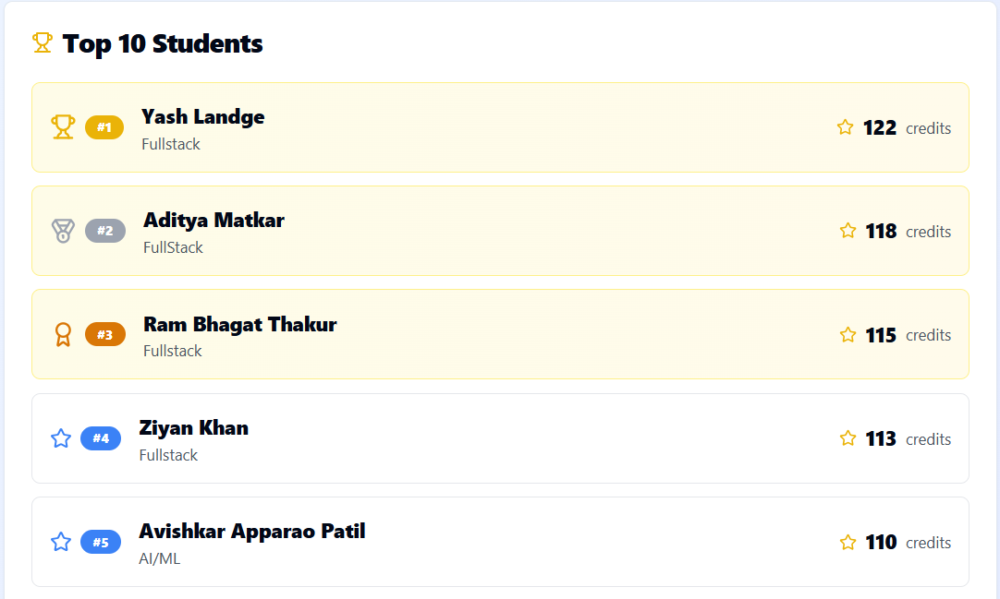

---


# 🏷️ Project Overview :

## [Dynamic Public Event Registration System](https://dynamic-public-event-registration-system.onrender.com/)

A full-stack web application that streamlines public event registration and management.


## 🔐 Admin Access (Demo Credentials)

You’re welcome to explore the admin dashboard using the demo credentials below.  
This access is provided for testing, learning, and evaluation purposes.

- **🔗 Deployment Link:** [`https://dynamic-public-event-registration-system.onrender.com/`](https://dynamic-public-event-registration-system.onrender.com/)
- **👤 Username:** `12345Admin`
- **🔑 Password:** `12345Admin`

> 🛡️ Please note: This is a demo admin account with limited privileges.  
> Data may reset periodically, and sensitive actions are restricted to protect the system.
---

## ⚙️ Accessibility & Usage Notes

- 🌓 **Dark Mode Recommended**: For optimal visual experience, please switch your system theme to **dark mode** or **light mode** based on your preference before using the application.

- 🕸️ **Content Loading Delay**: If data does not appear immediately, it may be due to **slow internet** or **delayed content loading**. Please **wait a moment** or **refresh the page**.

- 🔐 **Admin Token Expiry**: If you're an admin and remain logged in without logging out, your authentication token may expire after **1 hour**. In such cases, some dashboard content may not load properly. To resolve this:
  - **Logout once**
  - Then **login again with your credentials**

This will restore full access to the admin dashboard.

---

### 🎟️ For Users
- Browse upcoming events  
- Register with a dynamic form  
- Receive email confirmations  

### 🛡️ For Admins
- Secure login and role-based access  
- Create, edit, and delete events  
- View and export registrants  
- Manage feedback and contact submissions  

This platform brings together a seamless experience for both attendees and organizers — all in one dynamic, responsive system.

---

## 🚀 Getting Started

To set up the project locally, follow the steps in the **Installation & Setup** section.  
Make sure to review the **Prerequisites** and configure your `.env` files properly.

---

## 🤝 Contributing

We welcome contributions of all kinds — from bug fixes and accessibility improvements to new features and documentation polish.  
📘 Please read our [CONTRIBUTING.md](./CONTRIBUTING.md) for guidelines on how to get started.

---

## 🗂️ Project Roadmap

Explore our Open Source [Open Source Roadmap](https://github.com/users/ram-bhagat-thakur/projects/3) to see what's planned, in progress, and done.  
💡 Contributions welcome — feel free to pick a task or suggest your own!

---

## ✨ Features

This system delivers a complete event registration workflow for both users and admins, with dynamic UI interactions, robust access control, and a responsive design.


### 👤 User Features
- 🔍 **Browse Events**  
  View all upcoming public events with details like date, location, and description.

- 📄 **Event Details Page**  
  See full information about each event, including organizer info, schedule, and registration deadline.

- 📝 **Register for Events**  
  Fill out a dynamic form to book a spot. Confirmation is sent via email.

- 🎉 **Confetti Animation on Success**  
  Delightful visual feedback after successful registration.

---

### 🔐 Admin Features
- 🔑 **Secure Admin Login**  
  Requires valid user ID and password. Only registered admins can access the dashboard.

- 🧑‍💼 **Admin Management**  
  Existing admins can add new admins. No public access to admin creation.

- 📅 **Create / Edit / Delete Events**  
  Full CRUD functionality for managing event listings.

- 📋 **View Registrants**  
  See who registered for each event. Export lists to CSV.

- 📤 **Export Registrant Data**  
  One-click export of attendee lists for offline use or reporting.

- 💬 **Manage Feedback & Reviews**  
  View user-submitted feedback. Verify and post selected reviews to the homepage.

- 📨 **View Messages**  
  Access contact form submissions and user inquiries.

- 🧹 **Delete Feedback / Messages**  
  Clean up outdated or irrelevant entries.

---

### 🎯 System Features
- 🚫 **Protected Routes**  
  Admin routes are guarded via `ProtectedRoute` and JWT-based authentication.

- 🌐 **Responsive Design**  
  Fully responsive UI built with Tailwind CSS and Framer Motion.

- 📦 **Reusable Axios Instance**  
  Centralized API logic with environment-based config (`VITE_API_BASE_URL`).

- 🧪 **Robust Testing**  
  Backend and frontend tested with Vitest, Supertest, and Testing Library.

- 📁 **Modular Folder Structure**  
  Clean separation of concerns for scalability and maintainability.

---

## 🛠️ Technologies Used

This project leverages a modern full-stack architecture with robust tooling for development, testing, and deployment.

---

### 🖥️ Frontend (Vite + React)

- **Frameworks & Styling**:  
  Vite, React, Tailwind CSS, Framer Motion

- **Routing & State Management**:  
  React Router (`BrowserRouter`, `Routes`, `useNavigate`, `useLocation`, `useParams`),  
  React Hooks (`useState`, `useEffect`)

- **UI & Feedback**:  
  `react-icons/fi`, `react-toastify`, `react-hot-toast`, `react-confetti`, `Confetti`, `Toaster`, `ToastContainer`

- **Utilities**:  
  `axios`, `axiosInstance`, `exportToCSV`, `date-fns`, `differenceInDays`, `format`, `react-use`

- **Testing**:  
  `vitest`, `@testing-library/react`, `jest-dom`, `MemoryRouter`, `vi.mock`, `fireEvent`, `waitFor`, `screen`, `within`

---

### ⚙️ Backend (Express + MongoDB)

- **Frameworks & Database**:  
  `Express.js`, `MongoDB`, `Mongoose`

- **Authentication & Middleware**:  
  `JWT`, custom middleware (`authMiddleware`, `uploadMiddleware`)

- **Email Service**:  
  `Nodemailer` or similar (via `sendConfirmationEmail.js`)

- **Testing**:  
  `Vitest`, `Supertest`, custom test environment setup

- **Image Management**:  
  Integrated via `cloudinary` package for seamless image uploads, optimization, and deletion.

- **Environment Variables** (`.env`):
  ```env
  CLOUDINARY_CLOUD_NAME=your-cloud-name
  CLOUDINARY_API_KEY=your-api-key
  CLOUDINARY_API_SECRET=your-api-secret
  ```
---

### 🚀 Deployment

- **Hosting Platforms**:  
  *GitHub + Render + cloudinary*

- **Environment Configuration**:  
  `.env` and `.env.example` files for managing secrets and environment-specific settings

---

### 🔗 Live Demo

*https://dynamic-public-event-registration-system.onrender.com/*

---

### 🖼️ Screenshots of the Project

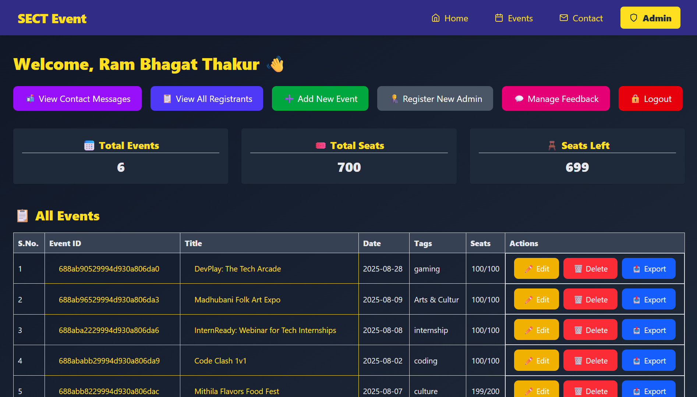

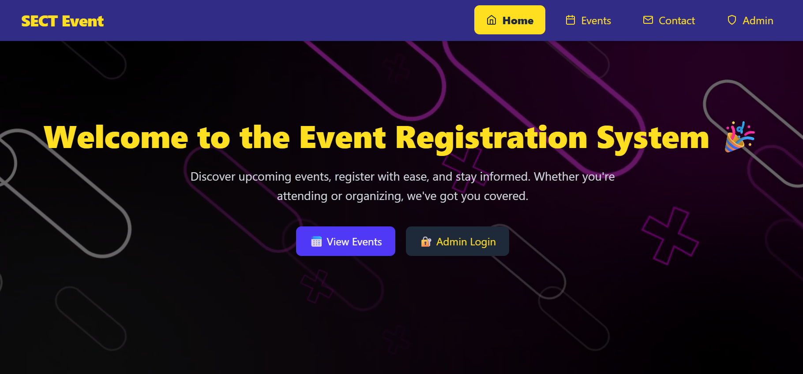

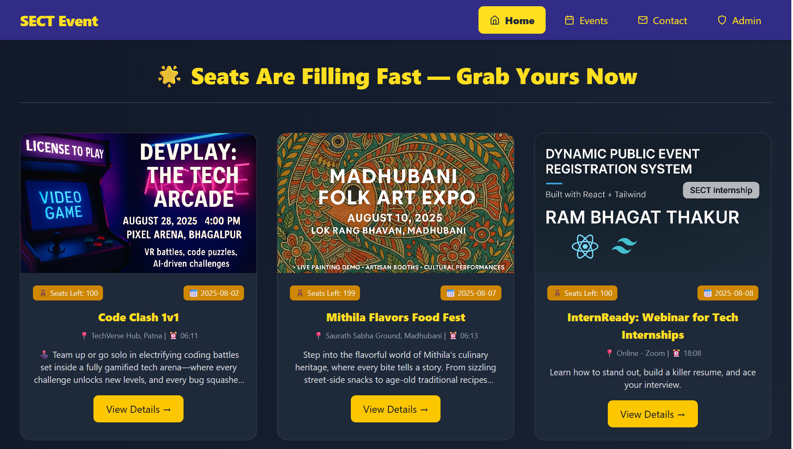

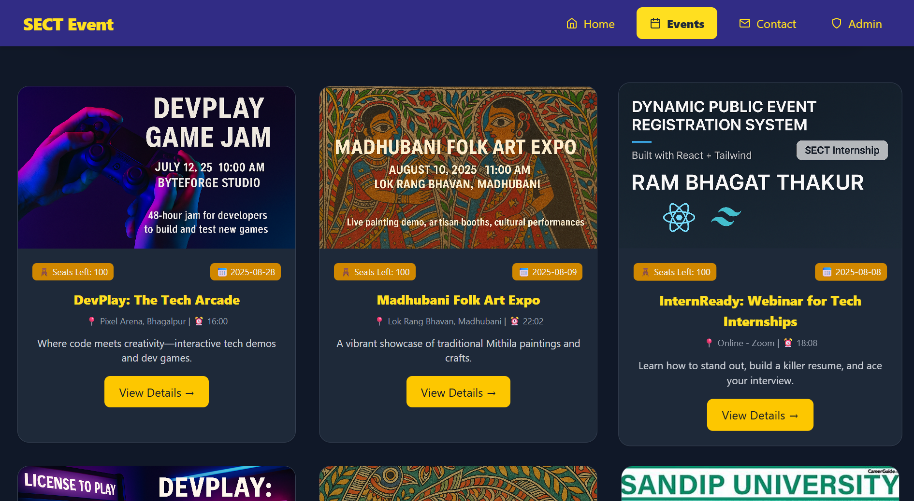

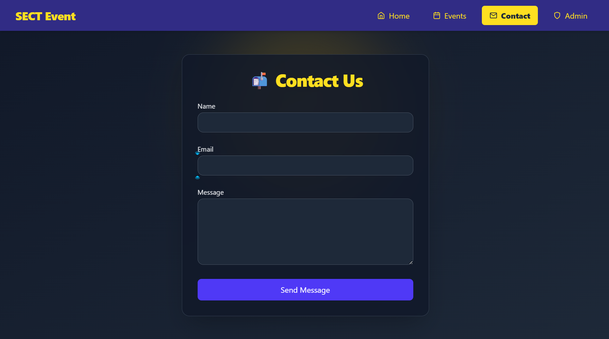


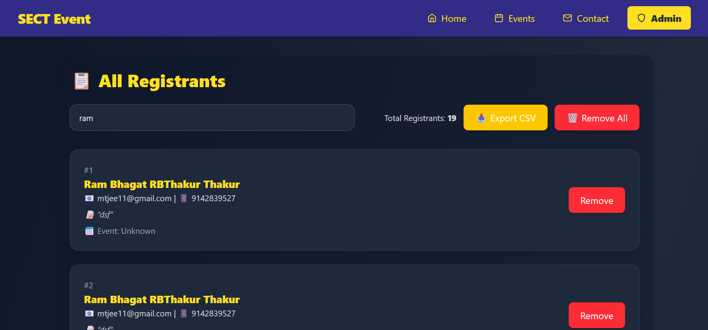

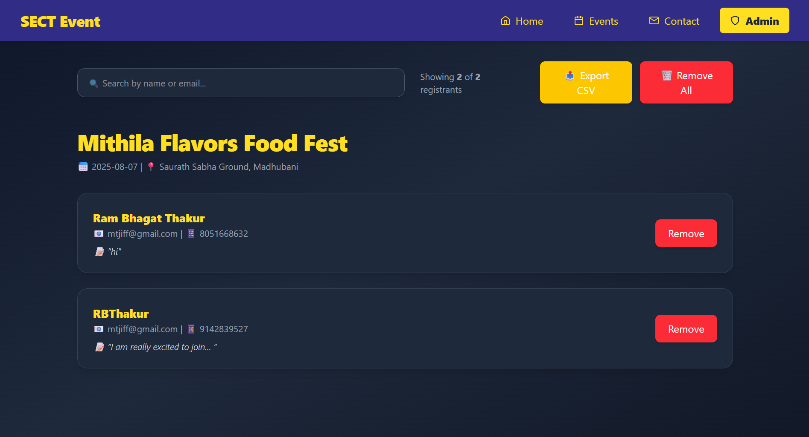

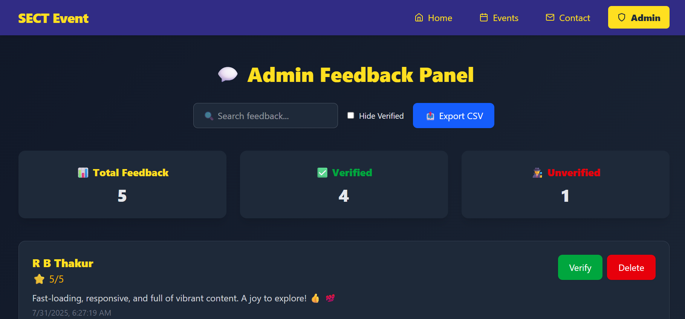

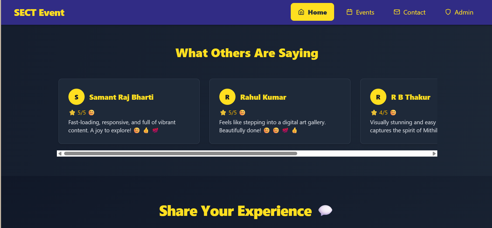

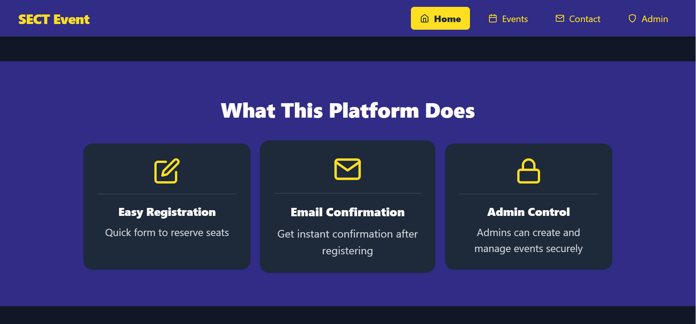

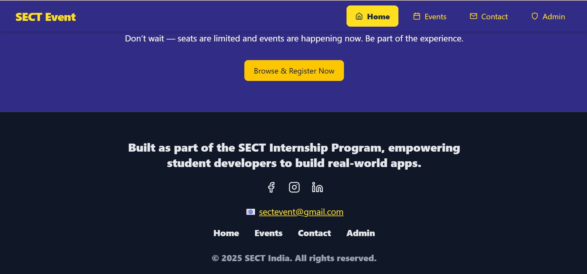

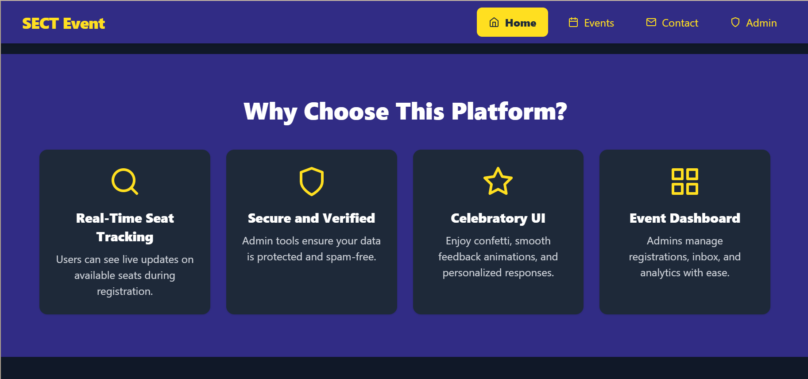

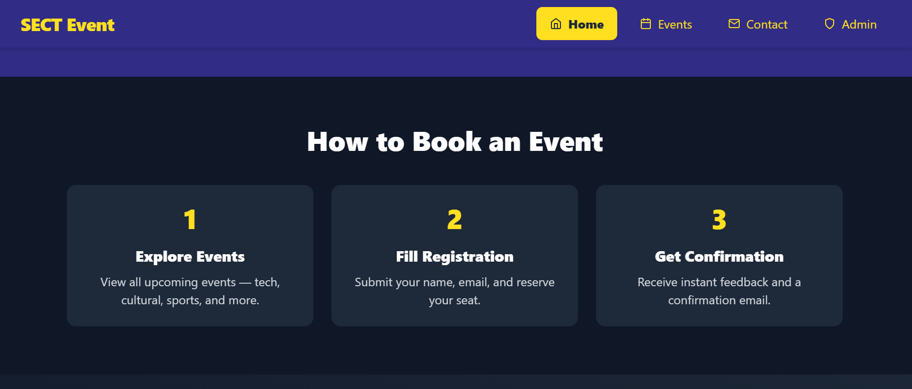

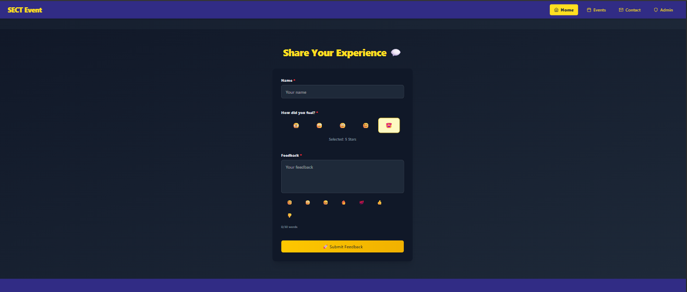

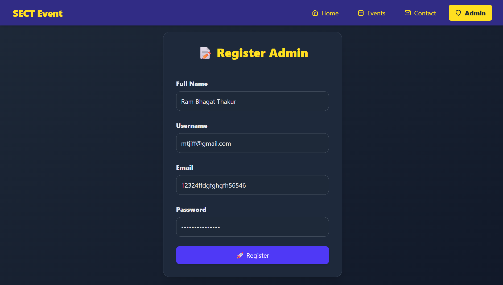

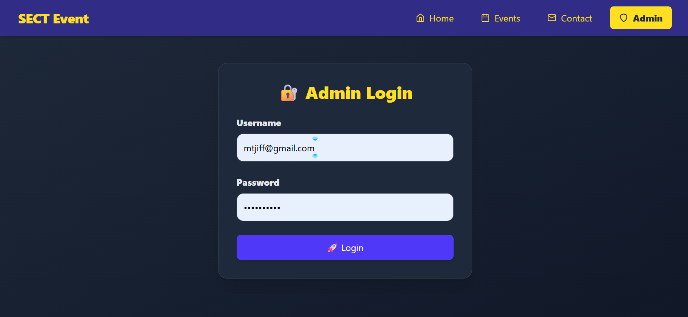

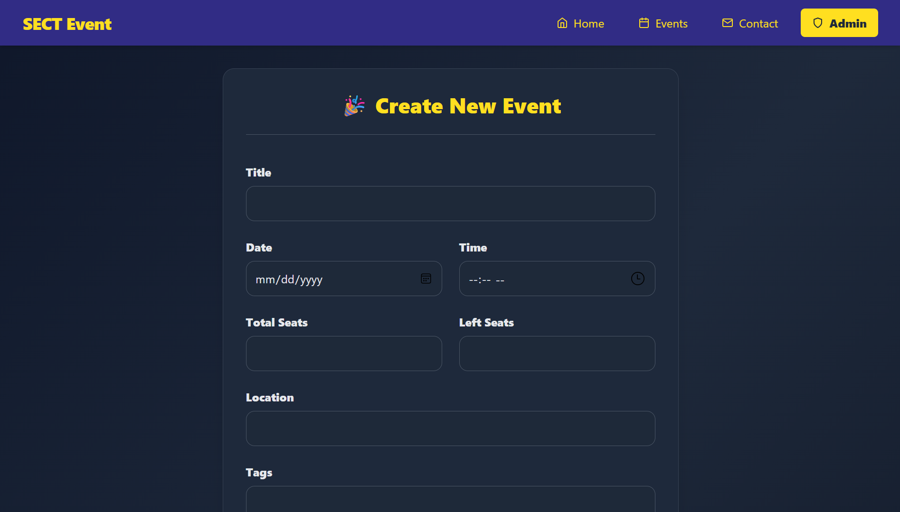

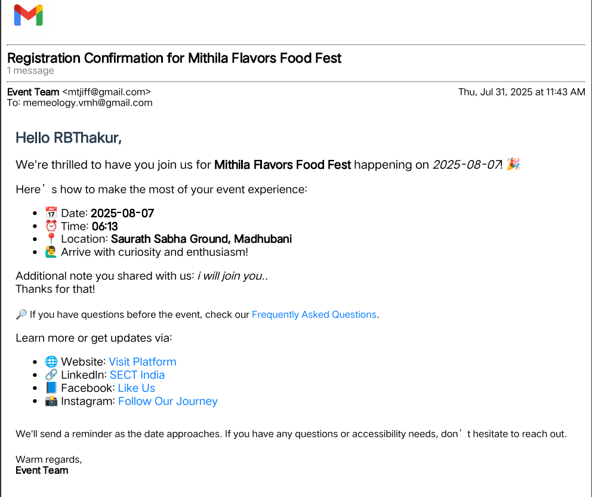

---

## ⚙️ Prerequisites

Before running the project locally, ensure the following tools and services are installed and configured:

---

### 🖥️ System Requirements

- **Node.js**: v18+ recommended  
- **npm**: Comes bundled with Node.js  
- **MongoDB**:  
  - Local instance for development  
  - MongoDB Atlas for production or remote testing

---

### 🌍 Global Tools

- **nodemon**: For hot-reloading during backend development  
  ```bash
  npm install -g nodemon
  ```

---

### 🌐 Environment Configuration

Set up your environment variables for both backend and frontend by copying `.env.example` to `.env` and filling in your credentials.

---

### 🛠️ Backend .env

```env
# MongoDB connection string (replace <username> and <password>)
MONGO_URI=mongodb+srv://<username>:<password>@cluster.mongodb.net/event-db

# JWT secret key for admin authentication
JWT_SECRET=your_jwt_secret_key

# Email credentials for sending confirmation emails
EMAIL_USER=your_email@example.com
EMAIL_PASS=your_email_app_password
```

---

### 🖥️ Frontend .env

```env
# Base URL for API requests (used by axiosInstance.js)
VITE_API_BASE_URL=http://localhost:5000
```


---

# 🌄 Image Uploads with Cloudinary Integration

This App supports robust, production-grade image handling via [Cloudinary](https://cloudinary.com), enabling persistent storage, secure delivery, and seamless deletion for uploaded images.

---

## ⚙️ How It's Implemented

- **Cloudinary Setup:**  
  A Cloudinary account was created and credentials added to `.env`:
  ```env
  CLOUDINARY_CLOUD_NAME=your-cloud-name
  CLOUDINARY_API_KEY=your-api-key
  CLOUDINARY_API_SECRET=your-api-secret
  ```
 
# 🌩️ Middleware Configuration

The backend includes a `cloudinary.js` config file and a **Multer + Cloudinary middleware** for handling image uploads.

---

## 📦 Dependencies Used

```js
import { v2 as cloudinary } from 'cloudinary';
import { CloudinaryStorage } from 'multer-storage-cloudinary';
import multer from 'multer';

cloudinary.config({
  cloud_name: process.env.CLOUDINARY_CLOUD_NAME,
  api_key: process.env.CLOUDINARY_API_KEY,
  api_secret: process.env.CLOUDINARY_API_SECRET,
});

const storage = new CloudinaryStorage({
  cloudinary,
  params: {
    folder: '', //set automatically uploads in this repo
    allowed_formats: ['jpg', 'jpeg', 'png'],
  },
});

export const upload = multer({ storage });
```

# 🔗 Route Integration: Image Upload with Cloudinary

During **event creation**, image files are uploaded via Multer and stored as secure **Cloudinary URLs**.

---

## 📤 Upload Route Setup

```js
router.post('/create', upload.single('image'), async (req, res) => {
  const imageUrl = req.file.path;
  // Save imageUrl to MongoDB along with other event data
});
```
# 🗑️ Secure Deletion: Cloudinary Image Removal

When an event is deleted, its associated image is removed from Cloudinary using the stored `public_id`.

---

## 🔧 Cloudinary Deletion Method

```js
// Handle banner removal
    if (req.body.removeBanner === 'true' && event.bannerPath) {
      const imagePath = path.join(__dirname, '..', 'uploads', event.bannerPath);
      fs.unlink(imagePath, (err) => {
        if (err) console.warn('Failed to delete banner:', err.message);
      });
      updatedData.bannerPath = '';
    }
```


# 🛡️ Benefits of Using Cloudinary for Image Management

---

## 📈 Advantages

- 🗂️ **Persistent Image Hosting**  
  Hosted images remain accessible long-term via secure URLs  
  with built-in **CDN caching** for global performance.

- ✨ **Automatic Optimization**  
  Cloudinary resizes and formats images automatically  
  based on device, viewport, and delivery context.

- 🧹 **Secure Image Deletion**  
  Removal is handled via `cloudinary.uploader.destroy(publicId)`  
  for precise and authenticated cleanup.

- 📦 **Simplified Deployment**  
  No need for manual uploads folder —  
  images are stored externally and accessed via Cloudinary URLs.

---

## 💡 Tip

> [!TIP]
> Make sure to **validate image inputs** on both the **frontend and backend**:
> - 🔍 Check **file type** (e.g., JPG, PNG)
> - 📏 Enforce **file size limits**
> - 🚫 Handle **upload errors gracefully**

---

## 🚀 Installation & Setup

Follow these steps to run the project locally:

### 1️⃣ Clone the Repository

```bash
git clone https://github.com/ram-bhagat-thakur/Dynamic-Public-Event-Registration-System.git
cd event-registration-system
```

---

### 2️⃣ Backend Setup

```bash
cd server
npm install
```

---

#### 🔧 Environment Variables

Create a `.env` file in the `server/` directory based on `.env.example`. Include:

```env
PORT=5000
MONGO_URI=your_mongodb_connection_string
JWT_SECRET=your_jwt_secret
EMAIL_USER=your_email@example.com
EMAIL_PASS=your_email_password
```

---

### 🚀 Run the Backend

```bash
npm run dev
```

The backend will start at: `http://localhost:5000`

---

### 3️⃣ Frontend Setup

```bash
cd client
npm install
```

---

#### 🔧 Environment Variables

Create a `.env` file in the `client/` directory:

```env
VITE_API_BASE_URL=http://localhost:5000
```

---

### 🚀 Run the Frontend

```bash
npm run dev
```

The frontend will start at: `http://localhost:5173` (or as shown in your terminal)

---

## 🔐 Admin Access

Admins have elevated privileges and can:

- 📅 Create, edit, and delete events  
- 📋 View registrants and export lists (CSV)  
- 💬 Manage feedback and reviews  
- ✅ Verify feedback for homepage display  
- 📨 View messages and contact submissions  
- 🧑‍💼 Add other admins (only existing admins can do this)  

⚠️ **Admins cannot be created via public registration.**  
Only a registered admin can promote another user to admin status.

---

### 🧭 Admin Login

To log in as an admin, you must:

- ✅ Be registered as a user  
- ✅ Have been granted admin privileges by an existing admin  
- 🔐 Provide your User ID and Password on the admin login screen

---

### 🧪 Optional: Seed Admin (for Development)

To bootstrap the system with an initial admin, manually insert a user with `role: "admin"` into your MongoDB database.

📦 **Example Document** (MongoDB shell or Compass):

```json
{
  "name": "Super Admin",
  "email": "admin@example.com",
  "password": "hashed_password",
  "role": "admin"
}
```

⚠️ Make sure the password is **hashed using bcrypt** before inserting.

---

## 👥 User Access

Regular users can:

- 🔍 View all public events  
- 📄 See event details  
- 📝 Register for events  

🚫 Users **cannot** access admin routes or dashboards.

---


📁 Folder Structure
The project is organized into two main directories inside sect-project:
- client/ for the frontend
- server/ for the backend

### 🖥️ `client/` — Frontend (Vite + React)

```txt
client/
├── public/
│   ├── images/              # Logos and static images
│   ├── videos/              # Background video for homepage header
│   └── _redirects           # SPA routing support (e.g., Netlify)
├── src/
│   ├── components/          # Reusable UI components
│   ├── pages/               # Route-based views (Home, Events, Admin, etc.)
│   ├── services/            # API service logic
│   ├── styles/              # Global CSS
│   ├── utils/               # Shared utilities (e.g., axiosInstance)
│   ├── __test__/            # Frontend test suites
│   └── setupTests.js        # Vitest + Testing Library setup
├── .env
├── index.html
├── vite.config.js
├── tailwind.config.js
└── package.json
```

### ⚙️ `server/` — Backend (Express + MongoDB)

```txt
server/
├── controller/              # Route handlers (auth, events, feedback, etc.)
├── middleware/              # Custom middleware (auth, upload)
├── models/                  # Mongoose schemas
├── routes/                  # Express route definitions
├── upload/                  # Uploaded event banner images
├── utils/                   # Helper functions (e.g., sendConfirmationEmail)
├── __tests__/               # Backend test suites
│   └── setupTestEnv.js      # In-memory MongoDB setup
├── .env
├── .env.example
├── index.js                 # Main server entry
├── app.js                   # Test entry point
└── package.json
```

### 📁 Full Folder Structure

```txt
sect-project/
├── client/                  # Frontend (React + Vite)
│   ├── node_modules/
│   ├── public/              # Static assets
│   │   ├── images/          # Logos and icons
│   │   ├── videos/          # Background video for homepage
│   │   └── _redirects       # SPA routing support (e.g. Render)
│   ├── src/                 # Application source code
│   │   ├── components/      # Reusable UI components
│   │   │   ├── Card.jsx
│   │   │   ├── Footer.jsx
│   │   │   ├── Navbar.jsx
│   │   │   ├── ProtectedRoute.jsx
│   │   │   └── ScrollToTop.jsx
│   │   ├── pages/           # Route-based pages
│   │   │   ├── AdminDashboard.jsx
│   │   │   ├── AddEvent.jsx
│   │   │   ├── AdminLogin.jsx
│   │   │   ├── AdminRegister.jsx
│   │   │   ├── AllRegistrant.jsx
│   │   │   ├── Contact.jsx
│   │   │   ├── EditEvent.jsx
│   │   │   ├── EventDetails.jsx
│   │   │   ├── EventRegistrants.jsx
│   │   │   ├── Events.jsx
│   │   │   ├── Home.jsx
│   │   │   ├── MessageList.jsx
│   │   │   ├── RegisterEvent.jsx
│   │   │   └── Welcome.jsx
│   │   ├── services/        # API service modules
│   │   │   ├── authService.js
│   │   │   ├── contactService.js
│   │   │   ├── csvService.js
│   │   │   ├── eventService.js
│   │   │   └── registrationService.js
│   │   ├── styles/          # Global styles
│   │   │   └── index.css
│   │   ├── utils/           # Utility functions
│   │   │   └── axiosInstance.js
│   │   ├── __test__/        # Frontend test suites
│   │   │   ├── components/
│   │   │   ├── pages/
│   │   │   ├── services/
│   │   │   └── utils/
│   │   ├── App.jsx
│   │   ├── main.jsx
│   │   └── setupTests.js    # Vitest setup
│   ├── .env                 # Frontend environment variables
│   ├── .gitignore
│   ├── eslint.config.js
│   ├── index.html
│   ├── package.json
│   ├── package-lock.json
│   ├── tailwind.config.js
│   └── vite.config.js
│
├── server/                  # Backend (Express + MongoDB)
│   ├── controller/          # Route controllers
│   │   ├── authController.js
│   │   ├── feedbackController.js
│   │   ├── contactController.js
│   │   ├── eventController.js
│   │   └── registrationController.js
│   ├── middleware/          # Custom middleware
│   │   ├── authMiddleware.js
│   │   └── uploadMiddleware.js
│   ├── models/              # Mongoose schemas
│   │   ├── Feedback.js
│   │   ├── Admin.js
│   │   ├── Contact.js
│   │   ├── Event.js
│   │   └── Registration.js
│   ├── routes/              # Express route definitions
│   │   ├── feedbackRoutes.js
│   │   ├── admin.js
│   │   ├── contact.js
│   │   ├── event.js
│   │   ├── register.js
│   │   └── registration.js
│   ├── upload/              # Uploaded event banners
│   ├── utils/               # Utility functions
│   │   └── sendConfirmationEmail.js
│   ├── __tests__/           # Backend test suites
│   │   ├── routes/
│   │   └── setupTestEnv.js
│   ├── .env
│   ├── .env.example
│   ├── .gitignore
│   ├── app.js               # Test entry point
│   ├── index.js             # Main server entry point
│   ├── package.json
│   ├── package-lock.json
│   └── vitest.config.js
```


---

### 🧪 `tests/` — Full-Stack Testing Overview

- **Backend**
  - **Tools**: `Vitest`, `Supertest`, `mongodb-memory-server`
  - **Coverage**: Route logic, middleware, edge cases

- **Frontend**
  - **Tools**: `@testing-library/react`, `Vitest`, `jest-dom`
  - **Coverage**: Component rendering, user interactions, route protection
  
---


## 🧪 Testing Instructions

This project includes comprehensive testing for both frontend and backend using **Vitest**, **Testing Library**, and **Supertest**.

---

### 🖥️ Frontend Testing

#### ✅ Tools Used

- `vitest`  
- `@testing-library/react`  
- `jest-dom`

#### 📦 Test Files Location

```
client/src/__test__/
├── components/       # Unit tests for reusable components
├── pages/            # Integration tests for route-based pages
├── services/         # API service mocks and tests
├── utils/            # Utility function tests
```

#### 🚀 Run Frontend Tests

```bash
cd client
npm run test
```

#### 🧪 Coverage (Optional)

To generate coverage reports:

```bash
vitest --coverage
```

---

### ⚙️ Backend Testing

#### ✅ Tools Used

- `vitest`  
- `supertest`  
- `mongodb-memory-server`

#### 📦 Test Files Location

```
server/__tests__/
├── routes/           # Route-level integration tests
└── setupTestEnv.js   # In-memory MongoDB and test environment setup
```

#### 🚀 Run Backend Tests

```bash
cd server
npm run test
```

🧪 Tests run against an **in-memory MongoDB instance** for isolation and speed.

---

### 🧠 What’s Covered

- ✅ Protected route access  
- ✅ Form validation and submission  
- ✅ API service logic  
- ✅ Event creation, editing, deletion  
- ✅ Registration flow and confirmation  
- ✅ Feedback and message handling  
- ✅ Role-based access control

---

# 📊 Sample Test Output & Coverage

## ✅ Frontend Test Output

## ✅ Test Coverage & Performance

This project includes comprehensive unit and integration tests for pages, components, services, and utilities.

| File                                  | Tests Passed | Duration |
|--------------------------------------|--------------|----------|
| RegisterEvent.test.jsx               | 4            | 741ms    |
| AdminDashboard.test.jsx              | 5            | 1147ms   |
| AddEvent.test.jsx                    | 4            | 1023ms   |
| Welcome.test.jsx                     | 5            | 627ms    |
| Navbar.test.jsx                      | 4            | 769ms    |
| EventRegistration.test.jsx           | 8            | 606ms    |
| AdminLogin.test.jsx                  | 3            | 649ms    |
| AllRegistrants.test.jsx              | 6            | 464ms    |
| EventDetails.test.jsx                | 5            | 543ms    |
| ProtectedRoute.test.jsx              | 2            | 134ms    |
| Card.test.jsx                        | 3            | 474ms    |
| eventService.test.js                 | 7            | 36ms     |
| registrationService.test.js          | 5            | 23ms     |
| authService.test.js                  | 1            | 14ms     |
| utils.test.js                        | 1            | 9ms      |

**Total Files Tested**: 17  
**Total Tests Passed**: 78  
**Execution Time**: ~46.15 seconds  
**Start Time**: 21:40:53

---

# ⚙️ Test Results & Insights

This section reflects backend reliability and realistic payloads logged during automated testing. All tests passed successfully with relevant input data.

---

# ⚠️ Known Warnings

> These issues do not break the test flow but should be resolved for production-grade stability.

- 🟡 **AdminDashboard.test.jsx**: React state updates not wrapped in `act(...)`
- 🟡 **Welcome.test.jsx**: `jsdom` navigation not implemented
- 🔴 **EventDetails.test.jsx**: Simulated fetch failure

### 📸 Screenshots
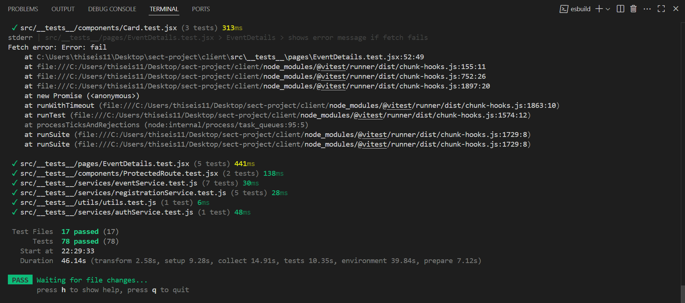

---

# 🧪 Backend Test Output (`__tests__/routes`)

| 🧾 Test File            | ✅ Tests Passed | ⏱️ Duration |
|------------------------|----------------|-------------|
| `feedback.test.js`     | 5              | 7183ms      |
| `admin.test.js`        | 5              | 8752ms      |
| `event.test.js`        | 6              | 5590ms      |
| `contact.test.js`      | 5              | 4940ms      |

**Total Files Tested**: 4  
**Total Tests Passed**: 21  
**Execution Time**: ~25.81 seconds  
**Start Time**: `21:43:52`

---

# 🗂 Sample Payloads (Logged During Tests)

```json
{
  "name": "Ram Bhagat",
  "username": "ramdev",
  "email": "ram@example.com",
  "password": "securepass123"
}

```

### 📸 Screenshots
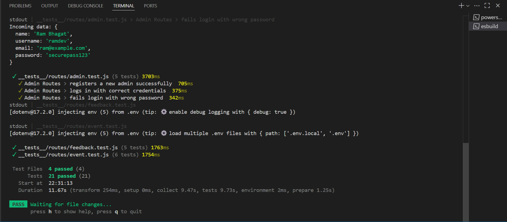

---


## 📦 Deployment Instructions (To Deploy Frontend and Backend with different different url)

This project is deployed using **Render**, which supports both static frontend hosting and backend services with environment variables.

---

### 🚀 Backend Deployment (Express + MongoDB)

#### ✅ Steps:

- Go to **Render Dashboard**  
- Click **“New Web Service”**  
- Connect your GitHub repo and select the `server/` folder  
- Set the following build and start commands:

```bash
Build Command: npm install
Start Command: npm run start
```

- Add the required environment variables:
  - `MONGO_URI`
  - `JWT_SECRET`
  - `EMAIL_USER`
  - `EMAIL_PASS`

- Choose a free or paid plan and deploy

🔁 Render will **auto-redeploy** on every push to the selected branch.

---

### 🌐 Frontend Deployment (Vite + React)

#### ✅ Steps:

- Go to **Render Dashboard**  
- Click **“New Static Site”**  
- Connect your GitHub repo and select the `client/` folder  
- Set the following build and publish settings:

```bash
Build Command: npm run build
Publish Directory: dist
```

- Add the required environment variable:

```env
VITE_API_BASE_URL=https://your-backend.onrender.com
```

---

# 📦 Deployment Instructions (Unified Frontend & Backend on a Single URL)

This approach merges your **React (Vite)** frontend with your **Express + MongoDB** backend, hosted together under one Render service.  
Ideal for seamless SPA routing, simplified API access, and persistent cloud image storage.

---

## 🔧 Pre-Deployment Setup

Before deploying to Render, build your frontend locally and prepare it for server-side serving:

### 1. Build the frontend

```bash
cd client
npm run build
```

- After successful build, move the dist folder to the backend directory:

```bash
mv dist ../server/
```

- Confirm that your Express server is configured to serve static assets:

```bash
// server/index.js
import path from 'path';
import express from 'express';

const app = express();

app.use(express.static(path.resolve(__dirname, 'dist')));

app.get('*', (req, res) => {
  res.sendFile(path.resolve(__dirname, 'dist', 'index.html'));
});
```


# 🚀 Deployment on Render

- Go to the Render Dashboard  
- Click “New Web Service”  
- Select the `server/` directory as your root deploy folder  
- Configure deployment settings:  
  ```bash
  Build Command: npm install
  Start Command: npm run dev
  ```

- Add the following environment variables:

```env
MONGO_URI=your-mongodb-uri
JWT_SECRET=your-jwt-secret
EMAIL_USER=your-email-username
EMAIL_PASS=your-email-password
PORT=10000
```
- Choose a plan (free or paid) and deploy!  
✅ Render will automatically redeploy your service on each push to the connected branch.

---

# 🧠 Notes

- No need for `VITE_API_BASE_URL` in this setup, as your frontend and backend share the same domain. But adding this will be easy. 
- Ensure your server uses fallback routing to support SPA navigation via direct links.  
- You can customize the deployment port with the `PORT` environment variable, commonly set to `10000` or Render’s default.

---


- Deploy and test

---

### 🧪 Post-Deploy Checklist

- ✅ Test all routes and endpoints  
- ✅ Verify email confirmation works  
- ✅ Check admin login and dashboard access  
- ✅ Confirm public event registration flow  
- ✅ Validate CORS and API connectivity between frontend and backend

---

## 🛠 Deployment Status

### 📊 Render Dashboard Preview

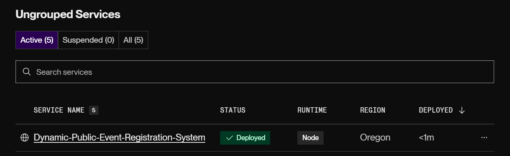

---

## 📄 Deployment Log (Unified Frontend & Backend on a Single URL)

```
2025-07-30T21:30:45.693019843Z ==> Cloning from https://github.com/ram-bhagat-thakur/Dynamic-Public-Event-Registration-System
2025-07-30T21:30:46.613369586Z ==> Checking out commit ee4dd315c6fb7676a3f0448a9206f2d7b9820133 in branch Development
2025-07-30T21:30:47.876313543Z ==> Downloading cache...
2025-07-30T21:31:04.357607419Z ==> Transferred 133MB in 8s. Extraction took 7s.
2025-07-30T21:31:34.466416214Z ==> Using Node.js version 22.16.0 (default)
2025-07-30T21:31:34.492802003Z ==> Docs on specifying a Node.js version: https://render.com/docs/node-version
2025-07-30T21:31:34.671541503Z ==> Using Bun version 1.1.0 (default)
2025-07-30T21:31:34.671556713Z ==> Docs on specifying a Bun version: https://render.com/docs/bun-version
2025-07-30T21:31:34.737867294Z ==> Running build command 'npm install'...
2025-07-30T21:31:35.803232053Z 
2025-07-30T21:31:35.803261854Z up to date, audited 323 packages in 986ms
2025-07-30T21:31:35.803286125Z 
2025-07-30T21:31:35.803324366Z 62 packages are looking for funding
2025-07-30T21:31:35.803331186Z   run `npm fund` for details
2025-07-30T21:31:35.804914006Z 
2025-07-30T21:31:35.804926876Z found 0 vulnerabilities
2025-07-30T21:31:38.899508371Z ==> Uploading build...
2025-07-30T21:31:48.363960553Z ==> Uploaded in 6.8s. Compression took 2.6s
2025-07-30T21:31:48.413233561Z ==> Build successful 🎉
2025-07-30T21:32:30.63052316Z ==> Deploying...
2025-07-30T21:32:52.310988356Z ==> Running 'npm run dev'
2025-07-30T21:32:53.516317683Z 
2025-07-30T21:32:53.519888384Z > server@1.0.0 dev
2025-07-30T21:32:53.519896094Z > nodemon index.js
2025-07-30T21:32:53.519898514Z 
2025-07-30T21:32:54.417392739Z [nodemon] 3.1.10
2025-07-30T21:32:54.419341954Z [nodemon] to restart at any time, enter `rs`
2025-07-30T21:32:54.41957021Z [nodemon] watching path(s): *.*
2025-07-30T21:32:54.419656803Z [nodemon] watching extensions: js,mjs,cjs,json
2025-07-30T21:32:54.420163497Z [nodemon] starting `node index.js`
2025-07-30T21:32:58.407244336Z [dotenv@17.2.0] injecting env (0) from .env (tip: ⚙️  enable debug logging with { debug: true })
2025-07-30T21:32:59.606346258Z [dotenv@17.2.0] injecting env (0) from .env (tip: 🔐 prevent committing .env to code: https://dotenvx.com/precommit)
2025-07-30T21:33:00.009066516Z (node:142) [MONGODB DRIVER] Warning: useNewUrlParser is a deprecated option: useNewUrlParser has no effect since Node.js Driver version 4.0.0 and will be removed in the next major version
2025-07-30T21:33:00.009088697Z (Use `node --trace-warnings ...` to show where the warning was created)
2025-07-30T21:33:00.009091837Z (node:142) [MONGODB DRIVER] Warning: useUnifiedTopology is a deprecated option: useUnifiedTopology has no effect since Node.js Driver version 4.0.0 and will be removed in the next major version
2025-07-30T21:33:03.032692459Z MongoDB connected
2025-07-30T21:33:03.034392447Z Server running on 5000
2025-07-30T21:33:11.442445034Z ==> Your service is live 🎉
2025-07-30T21:33:11.471477492Z ==> 
2025-07-30T21:33:11.498418859Z ==> ///////////////////////////////////////////////////////////
2025-07-30T21:33:11.524453637Z ==> 
2025-07-30T21:33:11.551231144Z ==> Available at your primary URL https://dynamic-public-event-registration-system.onrender.com
2025-07-30T21:33:11.577871992Z ==> 
2025-07-30T21:33:11.60408074Z ==> ///////////////////////////////////////////////////////////
```

---

### 🔗 Live Demo

*https://dynamic-public-event-registration-system.onrender.com/*

---

# 🔮 Future Improvements

A prioritized list of enhancements that will elevate testing, user experience, architecture, and community engagement.

---

# 🧪 Testing & QA

- ✅ **Full E2E Coverage**  
  Integrate **Playwright** or **Cypress** for end-to-end testing of user flows — including form validation, email confirmation, and admin dashboard interactions.

- 🧱 **Reusable Test Utilities**  
  Centralize shared mocks, setup functions, and scaffolds under `test-utils/` for scalable coverage and improved maintainability.

- 🧼 **CI Integration**  
  Implement **GitHub Actions** to run backend and frontend test suites automatically on every push and pull request for faster feedback loops.

---

# 🎨 UI/UX Enhancements

- ♿ **Accessibility Audits**  
  Run automated Lighthouse and axe-core scans to catch contrast issues, missing ARIA labels, and keyboard trap problems.

- 🧭 **User Delight Features**  
  Add subtle animations, contextual tooltips, and micro-interactions to elevate onboarding and enhance engagement.

- 🌙 **Dark Mode Toggle**  
  Create a theme switcher that respects system preferences and persists across sessions for user personalization.

---

# 🏗 Architecture & DevOps

- 🧩 **Role-Based Access Control**  
  Refactor backend authorization to support granular permissions for **admins**, **organizers**, and **attendees**.

- 🧵 **Monorepo Migration**  
  Move to a unified monorepo structure with shared linting, config files, and test tooling across frontend and backend folders.

- 🚀 **Staging Environment**  
  Deploy a staging instance via **Render** with test credentials and dummy data to validate features before production.

---

# 📢 Community & Documentation

- 📚 **Interactive Docs**  
  Add **Swagger** or **Redoc** for live API testing and documentation, making it easier for developers to understand and interact with endpoints.

- 🧑‍🏫 **Tutorial Series**  
  Publish a blog or video walkthrough to showcase project setup, test strategies, architectural decisions, and deployment workflow.

- 🪄 **AI-Powered Onboarding**  
  Embed Copilot-style smart guidance in both the **README** and app dashboard to help new contributors onboard quickly and intuitively.

---


## 🧑‍💻 Developer Notes & Acknowledgements

---

### 🧠 Design & Architecture Notes

- 🧩 **Modular Backend**:  
  Express routes are structured for testability and separation of concerns. Middleware, controllers, and services are decoupled for clarity and scalability.

- 🧪 **Test Coverage**:  
  Backend routes are covered with `Vitest` and `Supertest`, including mocking of `axiosInstance` and middleware logic.

- 🌐 **Environment-Agnostic Frontend**:  
  All API calls use a centralized `axiosInstance` with `VITE_API_BASE_URL`, making the app portable across dev, staging, and production.

- ♿ **Accessibility First**:  
  UI components follow WCAG guidelines, with keyboard navigation, ARIA roles, and semantic HTML baked in.

- 🛠 **Zero-to-Hero Setup**:  
  The README is designed to onboard any developer — no assumptions, no missing steps.

---

### 🙌 Acknowledgements

- 💡 **SECT Internship Program & Civora Nexus**:  
  For the opportunity to build, learn, and share in a professional environment.

- 🧪 **Testing Community**:  
  Inspired by open-source contributors pushing the boundaries of automated testing and mocking in Node.js.

- 🤝 **Mentors & Reviewers**:  
  Thanks to Sarthak Dighe sir and Subham Dighe sir for being my mentor and review code, architecture decisions, debugged test runners, and encouraged accessibility best practices.

- 🤖 **AI Collaboration**:  
  For this project i have taken help from AI. So this project was co-created with AI assistance for design iteration, code scaffolding, and documentation polish.

---

### 📬 Feedback & Contributions

Feel free to open issues, suggest improvements, or fork the repo.  
Every accessibility fix, test enhancement, or UX polish is welcome!

---


# 🧾 Final Summary

This project represents a scalable, full-stack solution tailored for dynamic event registration workflows. From robust backend architecture and real-time email confirmations to engaging UI enhancements and thoughtful accessibility audits, every feature has been designed with both functionality and user delight in mind.

🎯 Whether you're an admin managing events, a contributor exploring the codebase, or a developer eager to expand it further — this repository provides the blueprint for a modern, inclusive, and high-performing event system.

💡 With continuous improvements in testing, documentation, and community support, the project is well-positioned to evolve and thrive. Your feedback and contributions are the key to shaping its next chapter — **thank you for being a part of it!**

---


## 💬 Join the Conversation

We’ve opened [GitHub Discussions](https://github.com/ram-bhagat-thakur/Dynamic-Public-Event-Registration-System/discussions/1) to connect with contributors, mentors, and curious developers.

Feel free to:
- Ask questions about the codebase
- Share feedback or ideas
- Collaborate on improvements

👉 [Introduce yourself and join the thread](https://github.com/ram-bhagat-thakur/Dynamic-Public-Event-Registration-System/discussions/1)

---